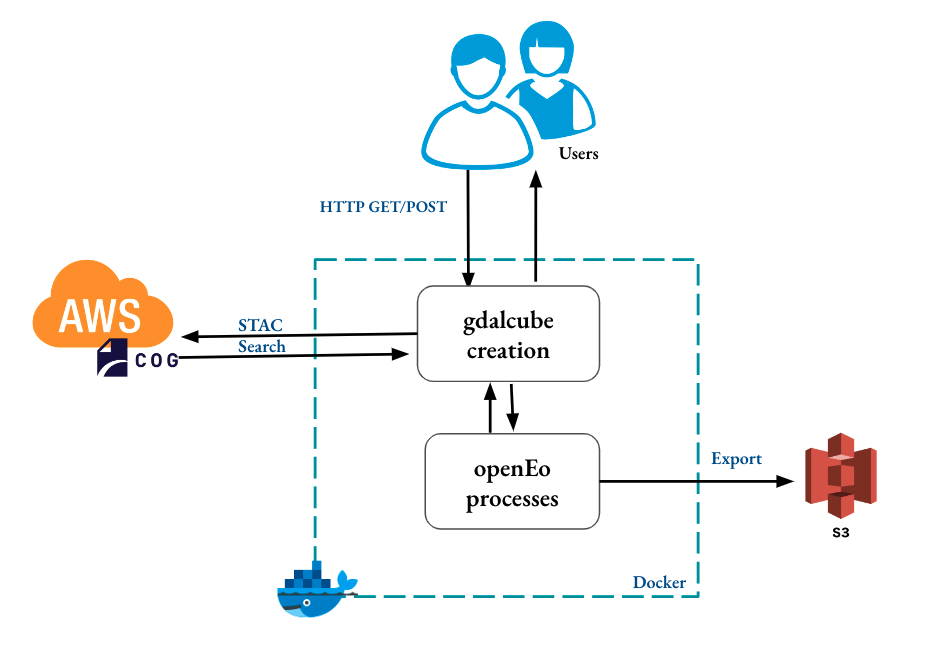

# Lightweight Platform for Processing Time Series Satellite Images

This service integrates STAC API, OpenEO standards and gdalcubes(Data Cubes) to be a  lightweight platform to enable processing of time series satellite images via RESTful APIs. It also supports users to run their custom R functions.





## Easy Deployment with Docker

Assuming you have Docker installed in your computing environment.
You first need to clone the repository via this command:

```bash
$ git clone https://github.com/PondiB/eo-datacube-platform.git
```

then you can change to that directory

```bash
$cd eo-datacube-platform
```

Run it :

```bash
docker-compose up
```

Run in detached mode :

```bash
docker-compose up -d
```

Shutting it down:

```bash
docker-compose down
```


##### Docker-Compose  commands for Reference

Run it:

```bash
docker-compose up
```

Run in detached mode:

```bash
docker-compose up -d
```

Shutting it down:

```bash
docker-compose down
```


Force restart  and rebuild:

```bash
docker-compose up --build --force-recreate --no-deps -d
```
